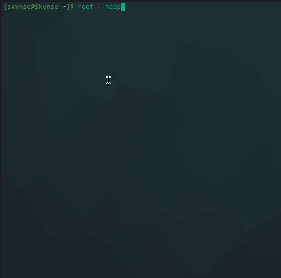

# Reef 
Network information gathering tool

# Feaures

* Port Scanning
* IP Scanning (with tables)
## Milestone
___

[x] Port Scanner\
[x] IP Scanner\
[ ] Selective Port scanning (tcp or udp?)\
[x] Windows Support (uses scapy)

## Installation

> sudo python3 setup.py install

### Usage

> sudo python -E reef [-sI] [-Sp]

